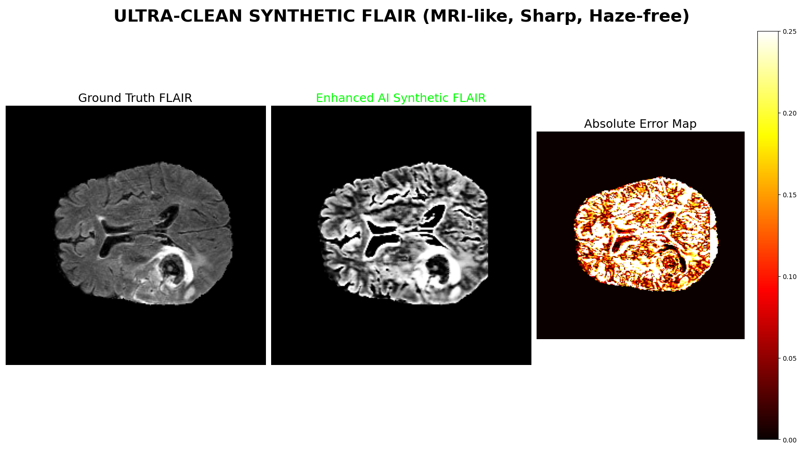

# MRI Modality Synthesis Using VAE-UNet

**Author:**  
**Vivek Showry**

---

## 🧠 Overview

This project focuses on **MRI modality synthesis**, specifically generating a missing **FLAIR MRI modality** from the available **T1, T1CE, and T2** modalities using a **VAE-UNet (Variational Autoencoder + UNet)** architecture.

In real-world medical imaging scenarios, MRI scans often suffer from missing modalities due to time, cost, or patient-related constraints. This project demonstrates how deep learning–based generative models can reconstruct missing modalities while preserving anatomical and pathological details.

---

## 🏗️ Model Architecture

The proposed model is a **VAE-UNet**, combining the strengths of:

- **Variational Autoencoder (VAE)**  
  → Learns a smooth and meaningful latent representation

- **UNet Decoder**  
  → Preserves spatial structure and fine anatomical details

### 🔹 Encoder (VAE Part)
- Input: **3 MRI modalities** (T1, T1CE, T2)
- Compresses input into a **latent space**
- Outputs:
  - `μ` (mean)
  - `logσ²` (variance)
- Helps the model generalize across different brain structures instead of memorizing samples

### 🔹 Decoder (UNet Part)
- Takes latent representation as input
- Uses downsampling and upsampling paths
- Reconstructs the missing **FLAIR** modality
- Produces a **synthetic MRI slice** with preserved spatial details

---

## ⚙️ Methodology

### 1️⃣ Dataset
- **BraTS 2020 Dataset** (Kaggle mirror)
- 250 selected patient cases
- Modalities per case:
  - T1
  - T1CE
  - T2
  - FLAIR

---

### 2️⃣ Preprocessing
Each MRI volume undergoes:
- Intensity normalization (1–99 percentile clipping)
- Scaling to `[0, 1]`
- Axial slice extraction
- Center cropping to `160 × 160`

For training:
- One modality is randomly treated as **missing**
- Remaining three are used as input
- Missing modality becomes the target output

---

### 3️⃣ Training
- **Loss Function**
  - L1 Loss → pixel-level accuracy
  - KL Divergence → smooth latent space
- **Optimizer:** Adam  
- **Learning Rate:** 1e-4  
- **Batch Size:** 4  
- **Epochs:** 10  

The model is trained **slice-by-slice**, enabling stable learning and memory efficiency.

---

### 4️⃣ Inference
During inference:
1. Load a patient case
2. Read T1, T1CE, and T2 modalities
3. Apply preprocessing
4. Predict missing FLAIR slices
5. Reconstruct full 3D MRI volume

---

## 📊 Results

The model successfully generates realistic **synthetic FLAIR MRI slices** that closely resemble ground truth images.

### 🔍 Visual Results
Below is a comparison showing the generated output and reconstruction quality:



### 📈 Observations
- Strong structural similarity with real FLAIR images
- Brain anatomy and tumor regions are well preserved
- Errors are minimal in normal tissue
- Slight blurring occurs near tumor boundaries (expected behavior)

---

## 📁 Repository Contents

```text
├── brats_dataset.py           # Dataset loading and preprocessing
├── check_accuracy.py          # Evaluation metrics (PSNR, SSIM, MAE)
├── inference_SHARP_PERFECT.py # Inference pipeline
├── vae_unet_improved.py       # VAE-UNet model architecture
├── result.png                 # Visual result comparison

```

---

## ✅ Strengths
- Realistic MRI synthesis
- Preserves anatomical structure
- Low noise output
- Consistent slice-wise reconstruction
- Suitable for downstream tasks (segmentation, analysis)

---

## ⚠️ Limitations
- Slight smoothing near tumor boundaries
- Bright regions may be under-reconstructed  
These are common limitations of VAE-based generative models.

---

## 📂 Dataset Reference

**BraTS 2020 Dataset (Training + Validation)**  
Kaggle:  
https://www.kaggle.com/datasets/awsaf49/brats20-dataset-training-validation

---

## 📌 Notes

Trained model checkpoints and full MRI volumes are excluded due to GitHub size constraints. They can be shared upon request.
